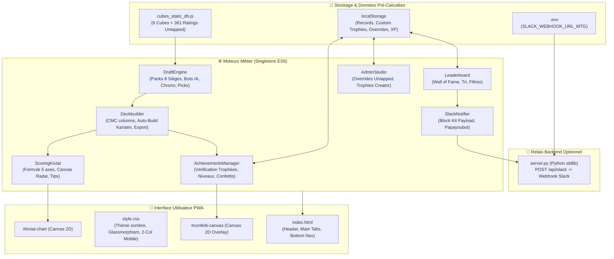

# SPECKIT TECHNICAL PLAN (/speckit-plan) : Cube Draft Mastery (001)

**Branch / Context :** `05_projets/mtg_cube_draft_app/`  
**Architecture Pattern :** Event-Driven Vanilla JS + Offline State Store + Canvas Radar  
**Status :** APPROVED  
**Date :** 2026-08-29

---

## 🏛️ 1. Architecture du Système & Flux de Données



---

## 📦 2. Modèles de Données & Contrats d'Interface

### Modèle `Card` (Statique & Dynamique)
```typescript
interface Card {
  name: string;          // Nom officiel anglais (ex: "Black Lotus")
  rating: number;        // Score continu Untapped (ex: 53.0)
  tier: "S"|"A"|"B"|"C"|"D"; // Tier de référence dérivé
  color: string;         // "Blanc" | "Bleu" | "Noir" | "Rouge" | "Vert" | "Multicolore" | "Incolore" | "Terrain"
  cmc: number;           // Coût converti de mana (1 à 6+)
  type: string;          // Type line (ex: "Creature — Human Soldier", "Artifact", "Instant")
  comment: string;       // Conseil stratégique & synergies de méta
  image: string;         // URL Scryfall haute résolution
  isCustomized?: boolean;// Marqueur de modification Admin
}
```

### Modèle `EvaluationResult` (Kiviat Radar)
```typescript
interface EvaluationResult {
  scores: {
    rawPower: number;    // 0 à 100 (Moyenne des ratings Untapped)
    synergy: number;     // 0 à 100 (Focus bicolore vs dilution)
    curve: number;       // 0 à 100 (Densité T1/T2 vs thons)
    mana: number;        // 0 à 100 (Ratio lands & sources Karsten)
    interaction: number; // 0 à 100 (Densité removals/contres)
  };
  overallScore: number;  // Score global pondéré (25 à 99/100)
  avgUntapped: string;   // Moyenne brute Untapped (ex: "47.8")
  diagnosis: {
    verdict: string;     // ex: "🔥 Deck God-Tier — Favori Absolu !"
    tips: string[];      // Liste de conseils tactiques personnalisés
  };
}
```

### Modèle `Trophy` (Gamification)
```typescript
interface Trophy {
  id: string;            // Identifiant unique
  scope: "ALL" | string; // "ALL" ou "nico_candyshop", "titou_tribal", etc.
  title: string;         // Titre affiché (ex: "Le Stormeur Fou")
  icon: string;          // Emoji (ex: "🌪️")
  desc: string;          // Description du défi
  xp: number;            // XP accordée (+150 à +300)
  category: string;      // Catégorie ou Nom du Cube
  ruleType: "speed" | "bombs" | "synergy_score" | "overall_score" | "heavy_spells" | "five_colors" | "avg_cmc" | "type_count" | "keywords" | "manual";
  threshold?: number;    // Valeur cible
  keywords?: string[];   // Liste de mots-clés combo
  targetType?: string;   // Type de carte requis
  isCustom?: boolean;    // Créé via Admin Studio
}
```

---

## ⚙️ 3. Algorithmes Clés

### Algorithme 1 : Auto-Build Karsten (Base de Mana Optimale)
```javascript
// 1. Détection des 2 couleurs majeures
const topColors = getDominantColors(mainboard);
// 2. Sélection des 23 meilleurs sorts
const activeSpells = selectTopSpells(mainboard, topColors, 23);
// 3. Calcul des besoins en pips de mana colorés
const colorPips = calculatePips(activeSpells);
// 4. Attribution proportionnelle des 17 terrains de base
const basicsDistribution = computeKarstenLands(colorPips, 17 - nonBasicLands.length);
```

### Algorithme 2 : Rendu Radar de Kiviat Canvas
```javascript
// Projection polaire : (angle, rayon * score) -> coordonnées Cartésiennes (x, y)
const angle = (Math.PI * 2 / 5) * i - Math.PI / 2;
const x = cx + Math.cos(angle) * (radius * (score / 100));
const y = cy + Math.sin(angle) * (radius * (score / 100));
```

---

## 🔒 4. Stratégie de Déploiement & Tests

1. **Serveur Local :** `python server.py` (Port 8080) avec ouverture automatique du navigateur.
2. **Accès Réseau Local (Smartphone) :** Connexion via `http://<IP_LOCALE>:8080` sur le Wi-Fi local.
3. **Persistance des Données :** `localStorage` (avec export JSON d'archivage).
