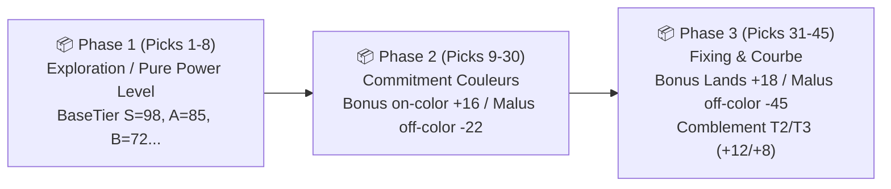

# SPECKIT RESEARCH : Cube Draft Mastery (001)

## 🔬 1. Fondements Mathématiques & Règles de Domaine

### A. Algorithme des Bots IA : Heuristique Draftmancer à 3 Phases

L'évaluation de chaque carte $c$ par un bot au pick $t \in [0, 44]$ s'exprime par la fonction :

$$\text{Score}(c, t) = \text{BaseTier}(c) + \Delta_{\text{color}}(c, t) + \Delta_{\text{curve}}(c, t) + \Delta_{\text{fixing}}(c, t)$$

#### Échelle des Valeurs Intrinsèques ($\text{BaseTier}$) :
* **Tier S (Bombe) :** $98 \text{ pts}$
* **Tier A (Staple) :** $85 \text{ pts}$
* **Tier B (Solide) :** $72 \text{ pts}$
* **Tier C (Soutien) :** $56 \text{ pts}$
* **Tier D (Filler/Niche) :** $40 \text{ pts}$

#### Vecteur de Préférences de Couleurs :
Pour un joueur bot ayant sélectionné un ensemble de cartes $P_t$, le score d'affinité pour chaque couleur $k \in \{W, U, B, R, G\}$ est calculé par :

$$V(k) = \sum_{c \in P_t, \text{Color}(c) = k} \text{BaseTier}(c)$$

Les 2 couleurs dominantes $\{D_1, D_2\}$ sont les 2 couleurs maximisant $V(k)$.

---

### B. Règles de Base de Mana de Frank Karsten (Hypergéométrie)
* Pour jouer un sort de manière fiable à $90\%$ de probabilité :
  * Un sort à **1 mana coloré (ex: {R}) au Tour 1** : nécessite **9 sources colorées** dans 40 cartes.
  * Un sort à **2 manas colorés (ex: {W}{W}) au Tour 3-4** : nécessite **13-14 sources colorées**.
  * Dans un deck bicolore 40 cartes typique (23 sorts + 17 terrains) : la répartition cible est de **8 à 9 sources par couleur majeure**.

---

### C. Évaluation Mathématique du Radar de Kiviat (5 Axes)

$$\text{Score Global} = \sum_{i=1}^{5} w_i \times S_i$$

| Axe $i$ | Libellé | Poids $w_i$ | Heuristique de Calcul |
| :--- | :--- | :---: | :--- |
| **1** | Puissance Brute | $20\%$ | Moyenne des Tiers : $S=100, A=85, B=70, C=55, D=40$ |
| **2** | Synergies d'Archétype | $25\%$ | Bonus bicolore $(+35)$ / Mono $(+45)$ $-$ Malus dilution $(-6 \times N_{\text{splash}})$ |
| **3** | Fluidité de la Courbe | $20\%$ | Pénalités si $T2 < 4$ $(-8/\text{manque})$, si $T3 < 3$ $(-6/\text{manque})$, si $T5+ > 5$ $(-8/\text{excès})$ |
| **4** | Base de Mana | $20\%$ | Pénalités ratio terrains hors $[15, 18]$ + Malus $-20$ si 3+ couleurs sans bilands détap |
| **5** | Densité d'Interaction | $15\%$ | Optimal $4 \le N_{\text{removals}} \le 7 \implies 95\%$, sinon pénalités graduelles |

---

### D. Tiebreakers Officiels de Tournoi Suisse
* **Points :** Match Gagné = 3 pts, Nul = 1 pt, Perdu = 0 pt.
* **OMW% (Opponents' Match Win %)** : Moyenne des pourcentages de victoires des adversaires rencontrés (plancher officiel à 33.33%).
* **GW% (Game Win %)** : Pourcentage de manches individuelles gagnées ($G_{\text{won}} / G_{\text{total}}$).

---

### E. Méthodologie d'Évaluation Hybride Reproductible (17Lands, CubeCobra & Cube Qualitative)

Pour étalonner objectivement chaque carte du Cube sans biais subjectif, l'évaluation repose sur un pipeline à double étage :

#### 1. Métriques Quantitatives Factuelles (17Lands & CubeCobra)
* **GIH WR (Game in Hand Win Rate %)** : Winrate global des decks lorsque la carte est présente en main ou piochée durant la partie.
  * $\text{GIH WR} \ge 60.0\% \implies \textbf{Tier S}$ (Bombe de format / First pick)
  * $57.0\% \le \text{GIH WR} < 60.0\% \implies \textbf{Tier A}$ (Staple majeure / Pilier)
  * $54.0\% \le \text{GIH WR} < 57.0\% \implies \textbf{Tier B}$ (Carte solide & synergique)
  * $50.0\% \le \text{GIH WR} < 54.0\% \implies \textbf{Tier C}$ (Soutien de courbe / Filler)
  * $\text{GIH WR} < 50.0\% \implies \textbf{Tier D}$ (Carte sous-performante / niche)
* **OH WR (Opening Hand Win Rate %)** : Mesure de l'impact de la carte lorsqu'elle est jouée dans le plan de départ (T1/T2).
* **ALSA (Average Last Seen At)** : Pick moyen de sélection dans les boosters.
* **IWD (Improvement When Drawn)** : Différence de winrate entre les parties où la carte est piochée vs non piochée ($\text{GIH} - \text{GND}$).
* **CubeCobra Inclusion % & Elo** : Taux de présence dans les cubes compétitifs et rating Elo communautaire.

#### 2. Grille Qualitative Structurée (4 Dimensions)
1. **Plancher vs Plafond (Floor vs Ceiling)** : Écart entre le pire scénario (plancher net) et le potentiel maximal en synergie (plafond).
2. **Densité de Synergie Multi-Archétypes** : Nombre d'archétypes du Cube activés sans pénalité de construction.
3. **Efficience de Mana & Courbe** : Timing d'impact et absence de tempo négatif.
4. **Coût d'Opportunité (Opportunity Cost)** : Pénalité d'inclusion par rapport aux alternatives de même coût.
